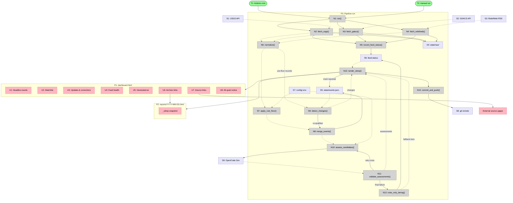

# HADR Monitor v1 — Shaping

Frame: `frame.md`. Interview record: `../../QUESTIONS.md`. Distilled
context: `../../CONTEXT.md`. Decisions with rationale: `../adr/`.

This shaping doc composes the grilling session's decisions into a single
shape and checks it against the requirements. The component alternatives
below were considered and rejected during grilling; they are kept as the
audit trail.

---

## Requirements (R)

| ID | Requirement | Status |
|----|-------------|--------|
| R0 | A duty officer deciding activation/escalation reads a severity-first situation report at 08:30 SGT, scannable in ~2 minutes, covering GDACS + USGS + ReliefWeb, all hazards, global | Core goal |
| R1 | Obvious noise is cut by a deterministic, permissive rule floor — every exclusion below the floor is explainable by a named rule, and missing a disaster is treated as worse than noise | Must-have |
| R2 | Surviving candidates are assessed and summarised in plain language (what, where, how bad, who is affected) and tiered into headline / watchlist / drop | Must-have |
| R3 | One physical event appears once — records from multiple feeds merge, with conflicting facts resolved by source domain and per-source attribution kept | Must-have |
| R4 | Changes to previously reported events are called out explicitly (magnitude revisions, deletions, colour escalations), and an escalated event re-qualifies even if previously filtered out | Must-have |
| R5 | A quiet day still publishes a dated "no significant events" report with feed health; published reports are immutable and archived | Must-have |
| R6 | Runs unattended on a schedule with no always-on personal machine; a down feed produces a partial report with a prominent banner, never a missing report | Must-have |
| R7 | State and audit trail are human-inspectable and diffable (plain files in the repo, git history) | Must-have |
| R8 | The LLM is confined to one seam behind a hosted endpoint (URL/api_key/model as config, not code); an LLM failure degrades to rules-only tiering and never blocks the 08:30 report | Must-have |

Constraint noted from grilling (lives in mechanisms, not R): ReliefWeb's
JSON API needs a not-yet-approved appname — v1 uses the no-auth RSS feed
(ADR-0004, QUESTIONS.md I3).

---

## CURRENT: Starter repo

No pipeline exists. The repo holds feed documentation (`feeds/*.md` with
verified endpoints and open questions), course scaffolding, and the docs
produced by grilling. Nothing fetches, filters, or publishes.

## A: Deterministic daily pipeline with one LLM seam

The composite selected through grilling (ADRs 0001–0006): a Python
pipeline on a GitHub Actions cron — fetch once, filter by rules, merge
into canonical events, diff against state, assess via LLM, render, commit.

| Part | Mechanism | Flag |
|------|-----------|:----:|
| **A1** | **Fetchers** — one module per source, each with bounded retry + backoff, writing latest raw payload to `state/raw/` | |
| A1.1 | USGS: GET `all_day.geojson` (rolling 24 h window) | |
| A1.2 | GDACS: GET `geteventlist/EVENTS4APP` (current event list, all hazards) | |
| A1.3 | ReliefWeb: GET `disasters/rss.xml`, parse items + GLIDE tag from description HTML | |
| **A2** | **Rule floor** — named tunable constants producing Candidates: GDACS Orange/Red → headline candidate; USGS mag ≥ 5.5 OR alert ≠ null OR sig ≥ 600 → candidate; new ReliefWeb disaster → candidate; GDACS Green quakes below USGS floor → dropped | |
| **A3** | **Canonical event store & merge** — match records by GLIDE (when present) else same hazard within ~100 km and ~1 h (haversine + time delta); merged CanonicalEvent keeps per-source attribution and all source IDs; conflicts resolved USGS→science, GDACS→alert/impact, ReliefWeb→narrative; persisted in `state/events.json` | |
| **A4** | **Change detection** — diff this run's merged events against `state/events.json`: new / revised (mag, location) / deleted / escalated (episodealertlevel rose); escalation past the floor re-qualifies a previously dropped event | |
| **A5** | **LLM assessment seam** — one function: capped worst-first candidate batch (~40) → OpenCode Zen `/v1/messages` (Anthropic-style, `qwen3.7-max`, auto tool choice on a `submit_assessments` tool with the assessment schema as `input_schema`, via requests/httpx) → validated {tier, summary} per event; one retry with validation errors appended, then rules-only tiering + note in Feed health | |
| **A6** | **Renderer** — build `dashboard.html` (Headline → Watchlist → Updates & corrections → Feed health → generated-at) and archive copy `reports/YYYY-MM-DD.html`; dashboard links to archive; all-quiet variant when no candidates | |
| **A7** | **Scheduled workflow** — GitHub Actions cron (UTC, margin before 08:30 SGT) runs A1→A6 and commits report + archive + state; `OPENCODE_API_KEY` as Actions secret, endpoint/model as config | |

**A5 flag resolved (2026-07-08):** Spike S1 (`spike-llm-endpoint.md`)
verified the OpenCode Zen endpoint with `qwen3.7-max`: 4/4 trials returned
schema-valid tool-use output at the 40-candidate batch size (59–98 s,
well inside the job budget). Caveats folded into A5's mechanism: forced
tool choice unsupported (use auto + prompt mandate), stdlib urllib blocked
(use requests/httpx), thinking model needs generous `max_tokens`.

### Alternatives considered and rejected (audit trail)

| Component | Rejected alternative | Why rejected | Record |
|-----------|---------------------|--------------|--------|
| A2+A5 | LLM judges every raw record | Costly, slow, exclusions unexplainable | ADR-0001 |
| A2+A5 | Rules only, no LLM | Blind to context (M5.2 under a dense city); no plain-language summaries | ADR-0001 |
| A3 | GLIDE-only matching | USGS never carries GLIDE; GDACS's often empty early — misses most merges | ADR-0002 |
| A3 | No dedup, report per feed | Same quake appears 2–3×, fails the 2-minute scan | ADR-0002 |
| A6 | Don't touch dashboard on quiet days | Stale page indistinguishable from dead agent | ADR-0003 |
| A6 | Single rolling page, no archive | Loses day-over-day record; corrections lose their referent | ADR-0003 |
| A7 | Local machine cron | Reports stop when the laptop is off — weak "unattended" | ADR-0004 |
| A7 | Continuous poller + 08:30 renderer | Needs always-on process; single daily fetch suffices (USGS all_day covers 24 h) | ADR-0004 |
| A7 | Hold report until all feeds respond | Officer may get no report at all — worse than a flagged partial | ADR-0004 |
| A3/A4 state | SQLite in repo | Binary diffs poorly; overkill for tens of events | ADR-0005 |
| A3/A4 state | Stateless re-derive | Corrections/escalation detection fragile | ADR-0005 |
| A5/A7 | Claude Code headless as the whole agent | Non-deterministic, hard to test; weak trust story for Day 3 | ADR-0006 |

---

## Fit Check: R × A

| Req | Requirement | Status | A |
|-----|-------------|--------|---|
| R0 | A duty officer deciding activation/escalation reads a severity-first situation report at 08:30 SGT, scannable in ~2 minutes, covering GDACS + USGS + ReliefWeb, all hazards, global | Core goal | ✅ |
| R1 | Obvious noise is cut by a deterministic, permissive rule floor — every exclusion below the floor is explainable by a named rule, and missing a disaster is treated as worse than noise | Must-have | ✅ |
| R2 | Surviving candidates are assessed and summarised in plain language (what, where, how bad, who is affected) and tiered into headline / watchlist / drop | Must-have | ✅ |
| R3 | One physical event appears once — records from multiple feeds merge, with conflicting facts resolved by source domain and per-source attribution kept | Must-have | ✅ |
| R4 | Changes to previously reported events are called out explicitly (magnitude revisions, deletions, colour escalations), and an escalated event re-qualifies even if previously filtered out | Must-have | ✅ |
| R5 | A quiet day still publishes a dated "no significant events" report with feed health; published reports are immutable and archived | Must-have | ✅ |
| R6 | Runs unattended on a schedule with no always-on personal machine; a down feed produces a partial report with a prominent banner, never a missing report | Must-have | ✅ |
| R7 | State and audit trail are human-inspectable and diffable (plain files in the repo, git history) | Must-have | ✅ |
| R8 | The LLM is confined to one seam behind a hosted endpoint (URL/api_key/model as config, not code); an LLM failure degrades to rules-only tiering and never blocks the 08:30 report | Must-have | ✅ |

**Notes:**
- R2 flipped ❌→✅ on 2026-07-08 when Spike S1 verified the endpoint
  (4/4 schema-valid trials at the 40-candidate batch size). Shape A now
  passes the full fit check with no flags.
- R8's wording generalised: the seam is Anthropic-style Messages, not
  OpenAI-compatible — Qwen models on OpenCode Zen only speak the former
  (ADR-0006 as amended). Confinement + degradation demands unchanged.

## Unsolved

1. Threshold constants (A2) and match windows (A3) are heuristics to
   revisit after a week of real reports — tracked in CONTEXT.md, not
   blocking.

## Next

Shape A is selected, unflagged, passes the fit check, and is breadboarded
below (Detail A). Slices live in `slices.md` (V1–V5); V1 is the pre-agreed
first slice (QUESTIONS.md J2): USGS → rules → LLM → dashboard, run by hand.

---

## Detail A: Breadboard

The system is a batch pipeline that publishes static HTML. The user-facing
surface is the report pages (P1, P2); everything else runs headless in the
pipeline (P3), kicked off by one of two triggers.

### Places

| # | Place | Description |
|---|-------|-------------|
| P1 | dashboard.html | Latest SitRep — the duty officer's morning page |
| P2 | reports/YYYY-MM-DD.html | Immutable archive copy of one day's SitRep (same layout as P1) |
| P3 | Pipeline run (backend) | One execution of A1→A7 on a GitHub Actions runner or local shell |

### Triggers

| # | Trigger | Fires |
|---|---------|-------|
| T1 | GitHub Actions cron (UTC, margin before 08:30 SGT) | → N1 |
| T2 | Manual run (`python -m hadr`) | → N1 |

### UI Affordances

| # | Place | Affordance | Control | Wires Out | Returns To |
|---|-------|------------|---------|-----------|------------|
| U1 | P1 | Headline events section — severity-sorted cards: hazard, alert colour, LLM summary | render | — | — |
| U2 | P1 | Watchlist section — one line per borderline event | render | — | — |
| U3 | P1 | Updates & corrections section — revisions, deletions, escalations vs prior SitReps | render | — | — |
| U4 | P1 | Feed health section; conditional "unreachable since …" banner per down feed | render | — | — |
| U5 | P1 | Generated-at timestamp | render | — | — |
| U6 | P1 | Archive links (one per past day) | click | → P2 | — |
| U7 | P1 | Per-event source links (GDACS report / USGS event page / ReliefWeb entry) | click | → external | — |
| U8 | P1 | All-quiet notice — replaces U1+U2 when no candidates | render (conditional) | — | — |
| _sitrep | P2 | Snapshot of U1–U5, U7, U8 for that date | — | → P1 layout | — |

### Data Stores

| # | Place | Store | Description |
|---|-------|-------|-------------|
| S1 | external | USGS `all_day.geojson` | Rolling 24 h earthquake feed |
| S2 | external | GDACS `geteventlist/EVENTS4APP` | Current multi-hazard event list |
| S3 | external | ReliefWeb `disasters/rss.xml` | Curated disaster entries (no auth) |
| S4 | P3 | `state/raw/*.json` | Latest raw payload per feed, overwritten each run |
| S5 | P3 | `state/events.json` | Canonical events: source IDs, merged facts, severity, reporting history |
| S6 | P3 | Run feed-status | Per-source fetch outcome + LLM-fallback note for this run |
| S7 | P3 | Config — `.env` / Actions secrets (`OPENCODE_API_KEY`), endpoint URL, model, threshold + match-window constants | Read-only configuration |
| S8 | external | Git remote (`origin/main`) | Publish target; git history is the audit trail |
| S9 | external | OpenCode Zen `/zen/go/v1/messages` | LLM endpoint (qwen3.7-max) |

### Code Affordances

| # | Place | Affordance | Control | Wires Out | Returns To |
|---|-------|------------|---------|-----------|------------|
| N1 | P3 | `run()` — pipeline entry | call | → N2, N3, N4 | — |
| N2 | P3 | `fetch_usgs()` — GET S1, bounded retry + backoff | call | → S4, → N5 | → N6 |
| N3 | P3 | `fetch_gdacs()` — GET S2, bounded retry + backoff | call | → S4, → N5 | → N6 |
| N4 | P3 | `fetch_reliefweb()` — GET S3, parse RSS + GLIDE from description HTML | call | → S4, → N5 | → N6 |
| N5 | P3 | `record_feed_status()` | call | → S6 | — |
| N6 | P3 | `normalize()` — per-source payload → common RawRecord dicts | call | — | → N7, → N9 |
| N7 | P3 | `apply_rule_floor()` — threshold constants (S7) → candidates | call | — | → N8 |
| N8 | P3 | `merge_events()` — GLIDE else geo+time match; source-precedence conflict resolution; per-source attribution | call | → S5 | → N10 |
| N9 | P3 | `detect_changes()` — diff ALL normalized records (pre-floor) against S5: new / revised / deleted / escalated; escalations past floor re-qualify | call | → N8 (re-qualified events join candidates) | → N13 (changes list) |
| N10 | P3 | `assess_candidates()` — the LLM seam: worst-first cap 40, prompt + `submit_assessments` tool, POST S9 via requests (key from S7) | call | → S9 | → N11 |
| N11 | P3 | `validate_assessments()` — schema, tier enum, event-id coverage; one retry with errors appended → N10 | call | → N10 (retry), → N12 (final failure) | → N13 (assessments) |
| N12 | P3 | `rules_only_tiering()` — fallback: floor level → tier, templated summary | call | → S6 (fallback note) | → N13 |
| N13 | P3 | `render_sitrep()` — assessments + changes + S6 → HTML; all-quiet variant when no candidates; marks events reported in S5 | call | → P1, → P2, → S5 | — |
| N14 | P3 | `commit_and_push()` — workflow step: commit dashboard, archive, state | call | → S8 | — |

**Verification pass:** every display U (U1–U5, U8) is written by N13, whose
inputs trace back through N11/N12 (assessments), N9 (changes), and S6
(health) — no orphan displays. Every N has wires out and/or returns to.
The one domain subtlety the wiring makes explicit: **N9 consumes
pre-floor records** (from N6, not N7) — revisions and deletions of
previously reported events must be detected even when today's record no
longer clears the floor.

### Wiring Diagram

