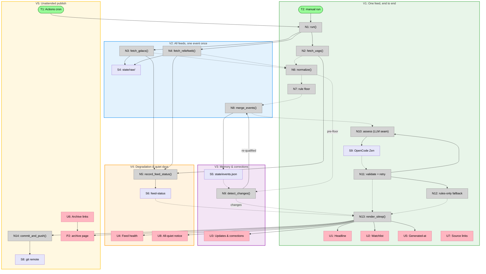

# HADR Monitor v1 — Slices

Vertical implementation slices of Shape A (see `shaping.md`, Detail A for
the full breadboard). Every slice ends in a demo on `dashboard.html`.
Affordance IDs refer to the breadboard tables.

## Slice Summary

| # | Slice | Mechanisms | Affordances | Demo |
|---|-------|-----------|-------------|------|
| V1 | One feed, end to end | A1 (USGS), A2, A5, A6 | T2, N1, N2, N6, N7, N10, N11, N12, N13, U1, U2, U5, U7, S1, S7, S9 | "Run `python -m hadr` by hand → dashboard.html shows last night's real earthquakes, tiered and summarised by qwen3.7-max" |
| V2 | All feeds, one event once | A1 (GDACS, ReliefWeb), A3 | N3, N4, N8, S2, S3, S4 | "A quake reported by both USGS and GDACS appears as ONE headline card with both source links" |
| V3 | Memory & corrections | A4 | N9, S5, U3 | "Run, tamper `state/events.json` (drop a magnitude), run again → Updates & corrections calls out the revision; a Green→Orange escalation re-enters the report" |
| V4 | Degradation & quiet days | A6 (variants) | N5, S6, U4, U8 | "Point the GDACS fetcher at a dead URL → report still publishes with an 'unreachable since …' banner; run with an empty candidate set → dated all-quiet page" |
| V5 | Unattended publish | A7 | T1, N14, S8, U6, P2 | "The 08:30 SGT Actions run commits a fresh dashboard + dated archive page with no human involved; dashboard links to past days" |

## Per-slice affordance tables

### V1: One feed, end to end (pre-agreed first slice)

Exercises every layer including the LLM seam. GDACS/ReliefWeb fetchers,
merging, state, and scheduling are stubs or absent; `detect_changes` and
feed health arrive later, so the render skips U3/U4 for now.

| # | Affordance | Control | Wires Out | Returns To |
|---|------------|---------|-----------|------------|
| T2 | Manual run (`python -m hadr`) | invoke | → N1 | — |
| N1 | `run()` | call | → N2 | — |
| N2 | `fetch_usgs()` (retry + backoff) | call | → N5 stub | → N6 |
| N6 | `normalize()` (USGS only) | call | — | → N7 |
| N7 | `apply_rule_floor()` (USGS thresholds from S7) | call | — | → N10 |
| N10 | `assess_candidates()` — LLM seam per ADR-0006 contract | call | → S9 | → N11 |
| N11 | `validate_assessments()` + one retry | call | → N10, → N12 | → N13 |
| N12 | `rules_only_tiering()` fallback | call | — | → N13 |
| N13 | `render_sitrep()` (headline + watchlist + timestamp) | call | → P1 | — |
| U1 | Headline events section | render | — | — |
| U2 | Watchlist section | render | — | — |
| U5 | Generated-at timestamp | render | — | — |
| U7 | Per-event source links (USGS event pages) | click | → external | — |

### V2: All feeds, one event once

| # | Affordance | Control | Wires Out | Returns To |
|---|------------|---------|-----------|------------|
| N3 | `fetch_gdacs()` | call | → S4, → N5 stub | → N6 |
| N4 | `fetch_reliefweb()` (RSS + GLIDE parse) | call | → S4, → N5 stub | → N6 |
| N8 | `merge_events()` — GLIDE else geo+time; source precedence; attribution | call | (→ S5 in V3) | → N10 |
| S4 | `state/raw/*.json` | store | — | debugging |

N6/N7 extend to GDACS + ReliefWeb record shapes and thresholds. U1/U7 now
show merged multi-source attribution.

### V3: Memory & corrections

| # | Affordance | Control | Wires Out | Returns To |
|---|------------|---------|-----------|------------|
| S5 | `state/events.json` — canonical events + reporting history | store | — | → N8, → N9 |
| N9 | `detect_changes()` — pre-floor records vs S5; escalation re-qualifies | call | → N8 | → N13 |
| U3 | Updates & corrections section | render | — | — |

N8 begins persisting to S5; N13 marks events reported in S5.

### V4: Degradation & quiet days

| # | Affordance | Control | Wires Out | Returns To |
|---|------------|---------|-----------|------------|
| N5 | `record_feed_status()` (stubs become real) | call | → S6 | — |
| S6 | Run feed-status (incl. LLM-fallback note) | store | — | → N13 |
| U4 | Feed health section + unreachable banner | render | — | — |
| U8 | All-quiet notice | render (conditional) | — | — |

### V5: Unattended publish

| # | Affordance | Control | Wires Out | Returns To |
|---|------------|---------|-----------|------------|
| T1 | Actions cron (UTC, margin before 08:30 SGT) | schedule | → N1 | — |
| N14 | `commit_and_push()` workflow step | call | → S8 | — |
| S8 | Git remote | store | — | audit trail |
| U6 | Archive links | click | → P2 | — |
| P2 | `reports/YYYY-MM-DD.html` archive place | — | — | — |

## Sliced breadboard

